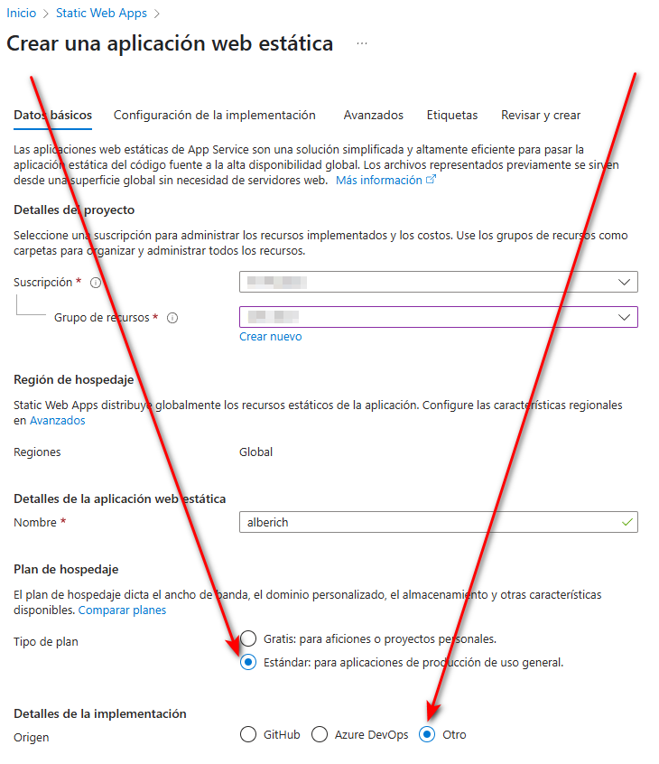
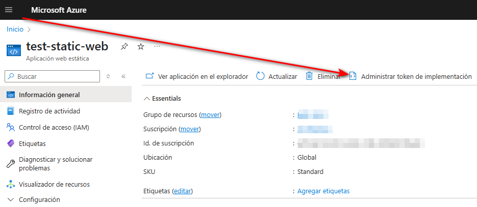

# Alberich

This project was generated using [Angular CLI](https://github.com/angular/angular-cli) version 19.1.8.

## Development server

To start a local development server, run:

```bash
ng serve
```

Once the server is running, open your browser and navigate to `http://localhost:4200/`. The application will automatically reload whenever you modify any of the source files.

## Code scaffolding

Angular CLI includes powerful code scaffolding tools. To generate a new component, run:

```bash
ng generate component component-name
```

For a complete list of available schematics (such as `components`, `directives`, or `pipes`), run:

```bash
ng generate --help
```

## Building

To build the project run:

```bash
ng build
```

This will compile your project and store the build artifacts in the `dist/` directory. By default, the production build optimizes your application for performance and speed.

## Running unit tests

To execute unit tests with the [Karma](https://karma-runner.github.io) test runner, use the following command:

```bash
ng test
```

## Running end-to-end tests

For end-to-end (e2e) testing, run:

```bash
ng e2e
```

Angular CLI does not come with an end-to-end testing framework by default. You can choose one that suits your needs.

## Additional Resources

For more information on using the Angular CLI, including detailed command references, visit the [Angular CLI Overview and Command Reference](https://angular.dev/tools/cli) page.

## implementar en web estatica
Crear la web estatica en Azure con "Otro" origen de implementacion



Despues crear el build de la web
```
ng build --configuration production

```

Una vez creada la carpeta "dist" con el build, ejecutar el comando de despliegue
```
npx swa deploy ./dist/alberich/browser --deployment-token <TOKEN-IMPLEMENTACION>
npx swa deploy ./dist/alberich/browser --deployment-token 1688597b580ea9fe8945789552a8ab9f0e7c18cf97e58d434085592f5b53a7c506-fdefff53-77ca-4063-ad53-0b359bde83080030826030d2db03
```
Para dexplegarlo directamente en producción
```
npx swa deploy ./dist/alberich/browser --deployment-token <TOKEN-IMPLEMENTACION> --env production
```
Si queremos promover un despliegue de preview a producción:
```
npx swa deploy ./dist/alberich/browser --deployment-token <TOKEN-IMPLEMENTACION> --deployment-id <ID_DEPLOY>
```

## Build con webConfig
```
ng build --configuration=production --base-href "/alberich/"
```
